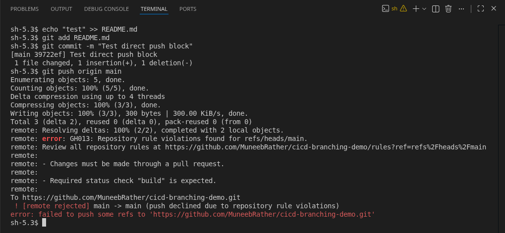
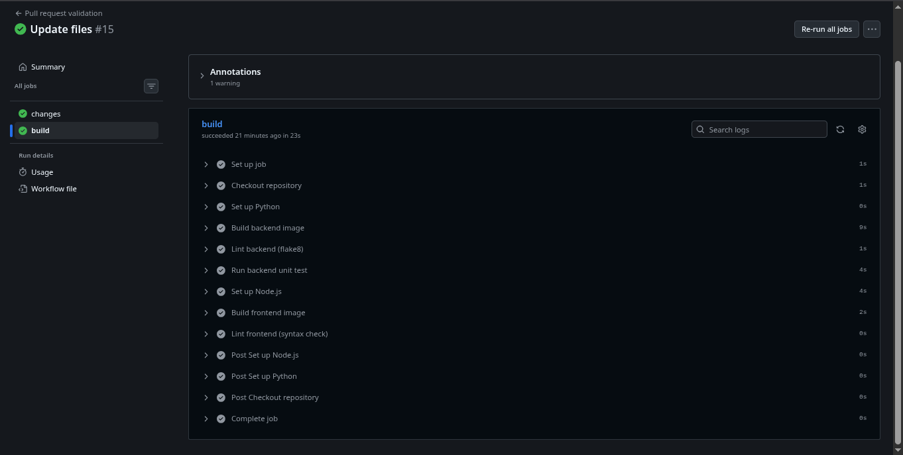
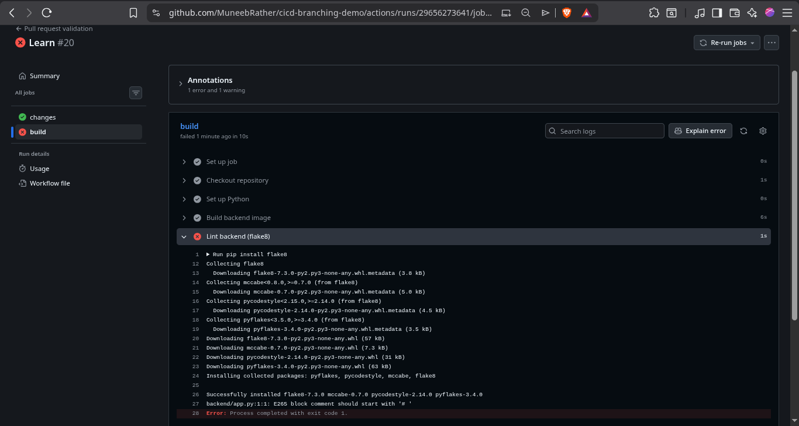
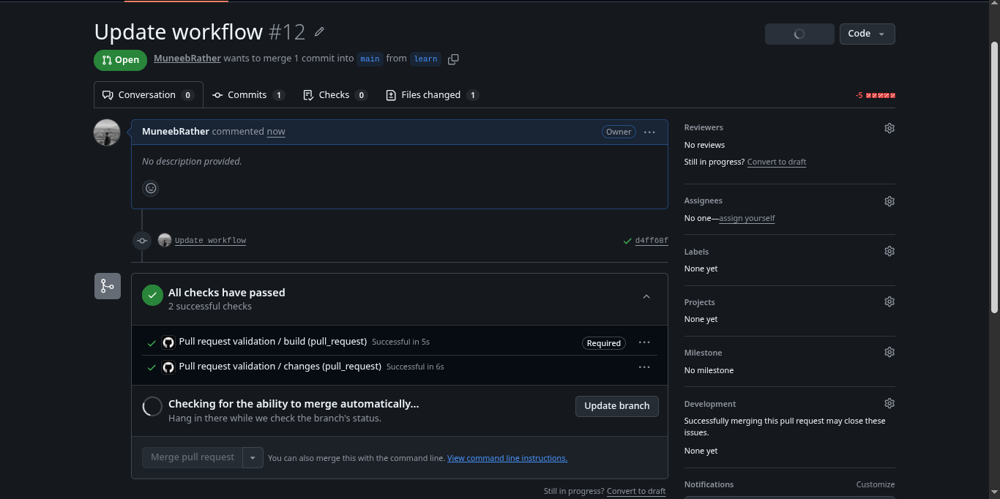
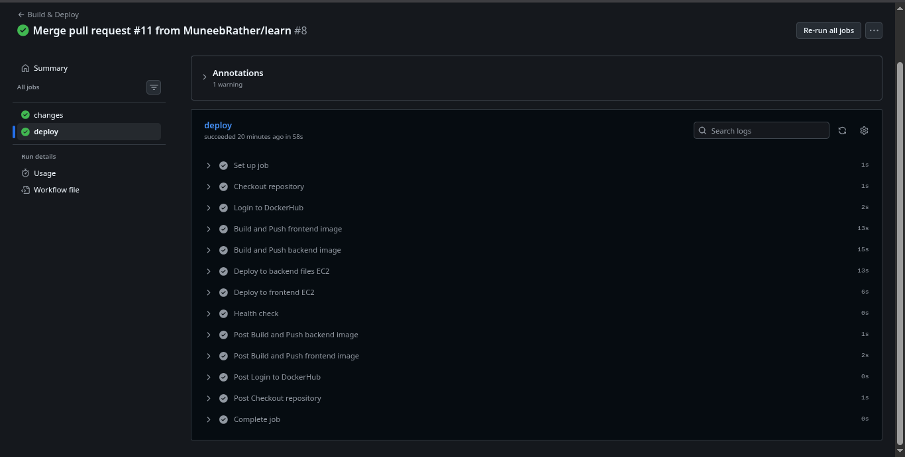
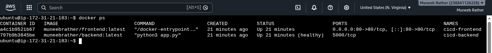
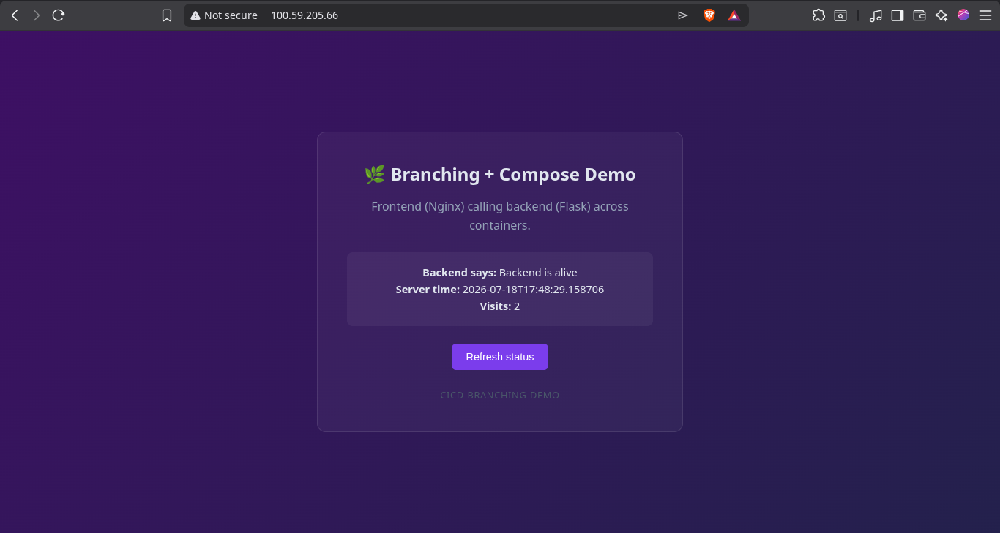

# cicd-branching-demo

A CI/CD pipeline that uses **feature branches + Pull Request validation + deploy-after-merge**, deploying a **frontend + backend** application to an **EC2** instance using **Docker Compose** and **GitHub Actions**. This is the capstone project in a four-repository CI/CD learning progression.

| Repo | Focus |
|---|---|
| cicd-s3-demo | CI/CD → S3 static site deployment |
| cicd-ec2-single-container-demo | CI/CD → Docker Hub → EC2 → single container |
| cicd-ec2-multi-container-demo | CI/CD → EC2 → two independent containers, one repository |
| **cicd-branching-demo** (this repo) | Docker Compose + branching strategy + PR validation + deploy-after-merge |

---

## What this repo demonstrates

- **Frontend + backend architecture** using a Flask backend (`backend/`) and a static frontend served by Nginx (`frontend/`), orchestrated with Docker Compose
- **Nginx as a reverse proxy** so the browser communicates only with Nginx while `/api/*` requests are forwarded internally to the backend container, eliminating CORS issues
- **Two independent GitHub Actions workflows**
  - `pr-checks.yml` — runs on Pull Requests into `main`, performing build, lint, and unit tests without accessing Docker Hub or EC2
  - `deploy.yml` — runs after code is merged into `main`, builds images, pushes them to Docker Hub, deploys them to EC2, and performs a post-deployment health check
- **Selective builds and deployments** using `dorny/paths-filter`, ensuring only services whose source folders changed are rebuilt and redeployed
- **Branch protection** requiring all changes to reach `main` through Pull Requests with successful validation checks
- **Docker Compose deployment** where EC2 pulls pre-built images from Docker Hub instead of building locally
- **Docker Compose health checks** using `depends_on: condition: service_healthy` so the frontend waits until the backend is healthy before starting
- **Post-deployment health verification** with automatic retries to ensure the application is running successfully before the workflow completes

---

## Architecture

```text
Pull Request → main
      │
      ▼
pr-checks.yml
      ├── changes job (paths-filter)
      └── build job
            ├── Build backend image (if backend changed)
            ├── Lint backend (flake8)
            ├── Run backend unit tests (pytest)
            ├── Build frontend image (if frontend changed)
            └── Lint frontend (node --check)

Merge → main (push event)
      │
      ▼
deploy.yml
      ├── changes job (paths-filter)
      └── deploy job
            ├── Login to Docker Hub
            ├── Build & push backend image
            ├── Build & push frontend image
            ├── SSH → EC2 → docker compose up -d backend
            ├── SSH → EC2 → docker compose up -d frontend
            └── Post-deployment health check
```

### Runtime request flow

```text
Browser
   │
   ▼
Nginx (Port 80)
   ├── Serves static frontend
   └── Proxies /api/* requests
            │
            ▼
Flask Backend (Port 5000 - Docker network only)
```

---

## Applications

### Backend

- Flask application (`backend/app.py`)
- Exposes `/api/status` and `/health`
- Runs on port **5000**
- Not exposed directly to the internet; only reachable through Nginx

### Frontend

- Static `index.html`, `style.css`, and `script.js`
- Served by Nginx on port **80**
- Uses relative `/api` requests instead of hardcoded container names or hostnames

---

## Setup

1. Create and test both Dockerfiles locally.
2. Create `docker-compose.yml` using Docker Hub image tags (`image:`) instead of local builds (`build:`).
3. Launch an EC2 instance and install Docker Engine and the Docker Compose plugin.
4. Configure the EC2 security group:
   - SSH (22)
   - HTTP (80)
5. Clone this repository onto the EC2 instance so the deployment workflow can use `docker-compose.yml`.
6. Add GitHub Secrets:
   - `DOCKERHUB_USERNAME`
   - `DOCKERHUB_TOKEN`
   - `EC2_HOST`
   - `EC2_USER`
   - `EC2_SSH_KEY`
7. Configure branch protection on `main`:
   - Require Pull Requests before merging
   - Require the PR validation workflow to pass
8. Develop on feature branches → Open Pull Request → Validate → Merge → Automatic deployment to EC2

---

## Workflow files

- `.github/workflows/pr-checks.yml`
- `.github/workflows/deploy.yml`

---

## Progress

- [x] Flask backend and static frontend developed
- [x] Nginx configured as a reverse proxy for `/api/*`
- [x] Dockerfiles and `.dockerignore` files created
- [x] Docker Compose configured using Docker Hub images
- [x] PR validation workflow implemented with selective build, lint, and unit testing
- [x] Deployment workflow implemented with selective build, push, deployment, and health verification
- [x] Branch protection configured to require Pull Requests and passing validation checks
- [x] Fixed flake8 formatting issues
- [x] Fixed pytest discovery by renaming `test.py` to `test_app.py`
- [x] Fixed missing dependency installation during PR validation
- [x] Updated the EC2 deployment to use the latest `docker-compose.yml` with `image:` instead of `build:`
- [x] Added retry-based health checks to avoid container startup timing issues
- [x] Verified complete workflow from Pull Request validation to automatic deployment

---

## Screenshots

### Branch protection — Direct push blocked



### GitHub Actions — Pull Request validation



### GitHub Actions — Validation failure



### Pull Request — Merge blocked



### GitHub Actions — Deployment



### EC2 — Running containers



### Live application



---

## What I learned

- How workflow-level trigger filters and step-level conditional execution solve different problems
- Why separating Pull Request validation and deployment into different GitHub Actions workflows results in a cleaner CI/CD pipeline
- The difference between building an application, linting code quality, and running unit tests—and why each validates a different aspect of the project
- How Nginx reverse proxying simplifies frontend-backend communication by eliminating CORS issues
- Why deployment servers should use Docker Compose with `image:` instead of `build:` when images are produced by CI
- Why deployment success should always be verified using post-deployment health checks instead of assuming successful SSH commands mean a healthy application
- How branch protection rules enforce a Pull Request-based workflow and prevent direct pushes to protected branches

---

## Author

**Muneeb Rather**